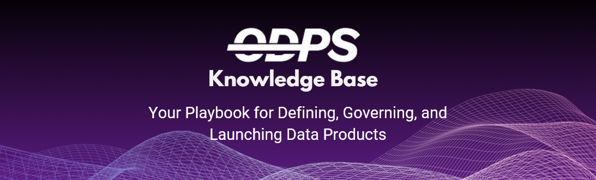

# 💡 Open Data Product Specification (ODPS) 
### FAQ and Resource Index

This repository helps you understand and apply the [ODPS specification](https://opendataproducts.org/) through practical, modular examples. Each question below links to a separate answer file, which includes:

- Explanation of the concept  
- Code snippets ([just plain YAML](faq/yaml)) 
- ODPS YAML examples (`.yml`) alongside the markdown answer  

### Want to go beyond the basics?###  

If you're looking to apply ODPS in real-world business scenarios, including **monetization strategies, AI agent readiness, and MCP integration**, check out these advanced Udemy courses:

- **[Data Product Monetization MasterClass](https://www.udemy.com/course/data-product-monetization-masterclass/)**  
  Learn how to turn ODPS-based data products into scalable revenue streams, including machine-readable pricing, AI agent monetization, and shadow pricing templates. Includes a complete Monetization Toolkit.

- **[Data Product MasterClass](https://www.udemy.com/course/data-product-mindset/)**  
  Adopt the data product mindset with practical frameworks, blueprints, and actionable strategies that build on ODPS concepts. Features real-world examples, and AI-powered narration.

👉 *Both courses are designed to complement this knowledge base—helping you move from learning the spec to delivering business impact.*

---

### Data Product Toolkit

The Data Product Toolkit is a free, open set of canvases designed to help teams design, measure, and manage data products effectively. It includes practical frameworks like the Data Product Canvas 2.1, Value Measure Framework, Blueprint Model, and more — all licensed under CC-BY. The toolkit guides you through defining use cases, aligning business value, and ensuring governance and scalability for successful data product development 

[Get your copy](./resources/Data_Product_Toolkit.pdf)

## What if I can not find what I was looking for?

If you can not find what you are looking for, [raise an issue and describe the need](https://github.com/Open-Data-Product-Initiative/odps-examples/issues). 

---

## 📘 Core Concepts

- [What is ODPS, and why should I use it?](faq/what-is-odps.md)  
- [What does a complete ODPS-compliant product look like?](faq/full-example.md)  
- [What are the required and optional sections in ODPS?](faq/required-optional.md)  
- [How do I define metadata for my data product?](faq/define-metadata.md)
- [How do I define related products and use cases?](faq/define-related.md)  

---

## 📄 Contract & Licensing

- [How do I define a contract for my data product?](faq/contract.md)  
- [How do I declare a license using ODPS?](faq/license.md)

---

## 💰 Pricing, Access & SLA

- [How do I define pricing plans?](faq/pricing.md)  
- [Can I offer free and paid tiers in the same product?](faq/mixed-tiers.md)  
- [How do I assign SLAs to pricing plans?](faq/sla-linking.md)  
- [How do I define and reuse a payment gateway?](faq/payment-gateways.md)

---

## 🔁 Referencing & Reuse

- [How do I reuse SLA, DQ, and Access across products?](faq/reuse-components.md)  
- [Can I reference external YAML files?](faq/external-ref.md)  
- [What’s the difference between internal and external references?](faq/internal-vs-external-ref.md)

---

## ✅ Data Quality & Access Control

- [How do I define data quality rules?](faq/data-quality.md)  
- [How do I specify access roles or visibility rules?](faq/access-control.md)

---

## 🤖 AI & Automation

- [How does ODPS support AI agent consumption?](faq/ai-agent-consumption.md)  

---

## 🛠️ Practical Use & Validation

- [How do I validate an ODPS YAML file?](faq/validation.md)  
- [Are there templates I can use to start faster?](faq/templates.md)  

---

📂 Each FAQ answer is located in the `/faq` folder, and includes a related `.yaml` file in the `yaml` folder. Contributions welcome.
