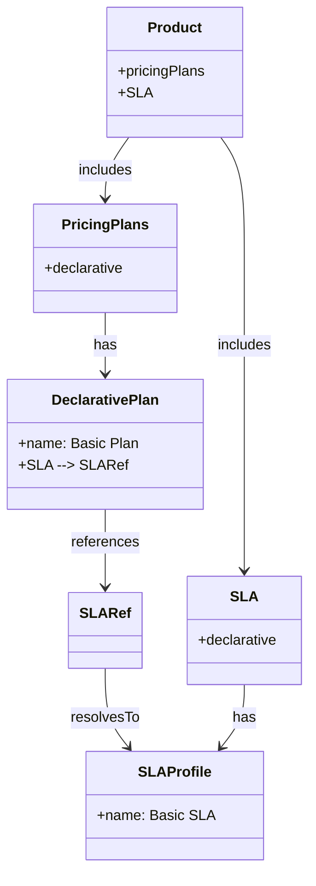

# What’s the difference between internal and external references?

In **ODPS 4**, both **internal** and **external** references can be used for objects like **SLA**, **dataQuality**, **paymentGateways**, and **dataAccess**.

---

## Internal reference

An **internal reference** means your pricing plan refers to a *specific profile or section inside an object already defined within the same YAML file*.

Example:

```yaml
pricingPlans:
  declarative:
    en:
      - name: Basic Plan
        SLA:
          $ref: '#/Product/SLA/default'

SLA:
  declarative:
    default:
      name:
        en: Basic SLA
```

You are pointing *inside* your current YAML file. No external files involved.



---

## External reference

An **external reference** means you point to a *whole object that is defined in another YAML file* (not just another section inside your file).

Example:

```yaml
schema: https://opendataproducts.org/v4.0/schema/odps.yaml
version: 4.0
product:
  contract:
    id: 02323M123  
    type:  ODCS 
    contractVersion:  2.2.2
    contractURL: https://demo.datamesh-manager.com/demo834016807886/dataproducts/9bd53b1b-b51e-41a8-a757-4d33b4cde460
  
  SLA:
    $ref: 'https://example.com/shared-sla.yaml'
  ...
```

✅ The SLA **object itself** is pulled from an external YAML file.  
✅ You are not pointing to a section inside your YAML — you are loading the object *entirely from elsewhere*.

---

## Key difference

| Internal ref | External ref |
|--------------|--------------|
| Refers to a part or profile of an object inside the same YAML file | Refers to an object whose YAML content is defined in another file (local or remote) |

➡ Both forms can be used with:  
**SLA**, **dataQuality**, **paymentGateways**, **dataAccess**

---

## Tip

- Use internal refs to link to specific profiles within your file.  
- Use external refs to pull entire shared objects maintained in other files or locations.
