# How do I reuse SLA, DQ, and Access across products?

ODPS encourages modularity by allowing shared components to be **referenced across multiple pricing plans and products** using `$ref`. This avoids duplication and keeps your data product specs clean, maintainable, and scalable.

This guide explains how to reuse:

- ✅ SLA (Service Level Agreement) packages  
- ✅ DQ (Data Quality) packages  
- ✅ Data Access configurations (API, file, agent)  
- ✅ Payment gateways


## Why reuse?

- **DRY Principle:** Define once, reuse many times  
- **Consistency:** Centralized updates to SLA/DQ apply everywhere  
- **Clarity:** Pricing plans focus only on variations, not boilerplate

## Shared Component Definition

Declare your reusable components at the top level of your `product` object. Example:

```yaml
SLA:
  default:
    name:
      en: The Basic SLA
    dimensions:
      - dimension: uptime
        objective: 90
        unit: percent
  premium:
    name:
      en: The Premium SLA
    dimensions:
      - dimension: uptime
        objective: 99
        unit: percent

dataQuality:
  default:
    displaytitle:
      en: The Basic Data Quality
    dimensions:
      - dimension: accuracy
        objective: 90
        unit: percentage

dataAccess:
  API:
    outputPorttype: API
    format: JSON
    accessURL: 'https://example.com/api'
    authenticationMethod: OAuth

paymentGateways:
  default:
    type: Stripe
    version: 1
```


## 💰 Referencing in `pricingPlans`

Each pricing plan can reuse these shared components via `$ref`:

```yaml
pricingPlans:
  declarative:
    en:
      - name: Basic Reader
        price: 0
        SLA:
          $ref: '#/SLA/default'
        dataQuality:
          $ref: '#/dataQuality/default'
        access:
          $ref: '#/dataAccess/API'
        paymentGateway:
          $ref: '#/paymentGateways/default'
```


## 🔄 Visualizing the Relationships

```mermaid
classDiagram

class Product {
  +pricingPlans
  +SLA
  +dataQuality
  +dataAccess
  +paymentGateways
}

class PricingPlan {
  +name
  +price
  +paymentGateway --> PaymentGateway_Ref
  +dataQuality --> DataQuality_Ref
  +SLA --> SLA_Ref
  +access --> DataAccess_Ref
}

Product --> PricingPlan : includes
PricingPlan --> SLA_Ref : uses
SLA_Ref --> SLA : resolvesTo
PricingPlan --> DataQuality_Ref : uses
DataQuality_Ref --> dataQuality : resolvesTo
PricingPlan --> DataAccess_Ref : uses
DataAccess_Ref --> dataAccess : resolvesTo
PricingPlan --> PaymentGateway_Ref : uses
PaymentGateway_Ref --> paymentGateways : resolvesTo
```




## Best Practices

- Use consistent naming (`default`, `premium`) to simplify `$ref` logic
- Document what each shared SLA or DQ package guarantees
- Version your SLA and DQ definitions if terms evolve over time


