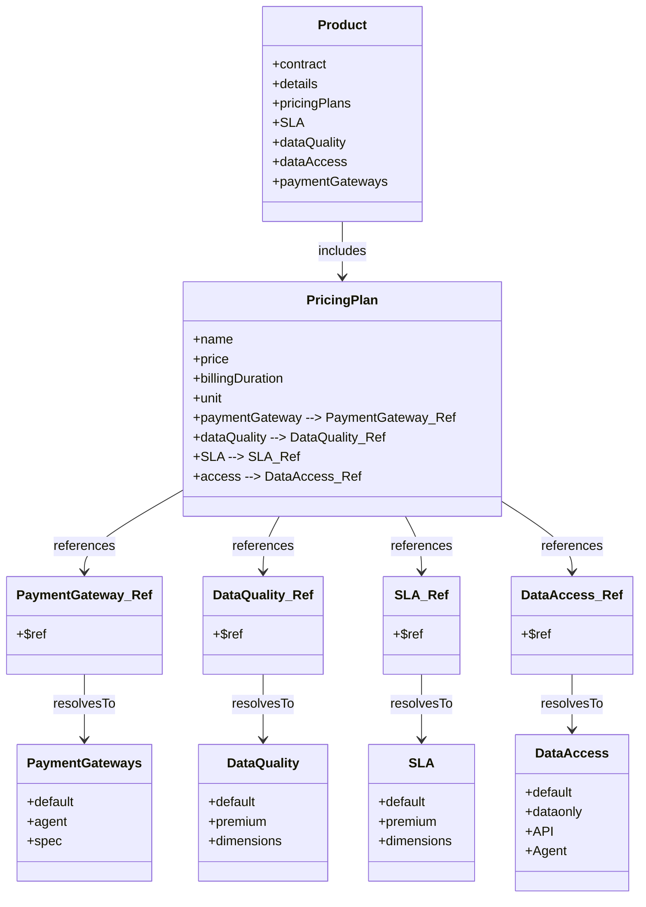

# How do I reuse SLA, DQ, and Access across products?

```mermaid
classDiagram

class Product {
  +contract
  +details
  +pricingPlans
  +SLA
  +dataQuality
  +dataAccess
  +paymentGateways
}

class PricingPlan {
  +name
  +price
  +billingDuration
  +unit
  +paymentGateway --> PaymentGateway_Ref
  +dataQuality --> DataQuality_Ref
  +SLA --> SLA_Ref
  +access --> DataAccess_Ref
}

class PaymentGateway_Ref {
  +$ref
}
class DataQuality_Ref {
  +$ref
}
class SLA_Ref {
  +$ref
}
class DataAccess_Ref {
  +$ref
}

class SLA {
  +default
  +premium
  +dimensions
}

class DataQuality {
  +default
  +premium
  +dimensions
}

class PaymentGateways {
  +default
  +agent
  +spec
}

class DataAccess {
  +default
  +dataonly
  +API
  +Agent
}

Product --> PricingPlan : includes
PricingPlan --> PaymentGateway_Ref : references
PaymentGateway_Ref --> PaymentGateways : resolvesTo
PricingPlan --> DataQuality_Ref : references
DataQuality_Ref --> DataQuality : resolvesTo
PricingPlan --> SLA_Ref : references
SLA_Ref --> SLA : resolvesTo
PricingPlan --> DataAccess_Ref : references
DataAccess_Ref --> DataAccess : resolvesTo
```
